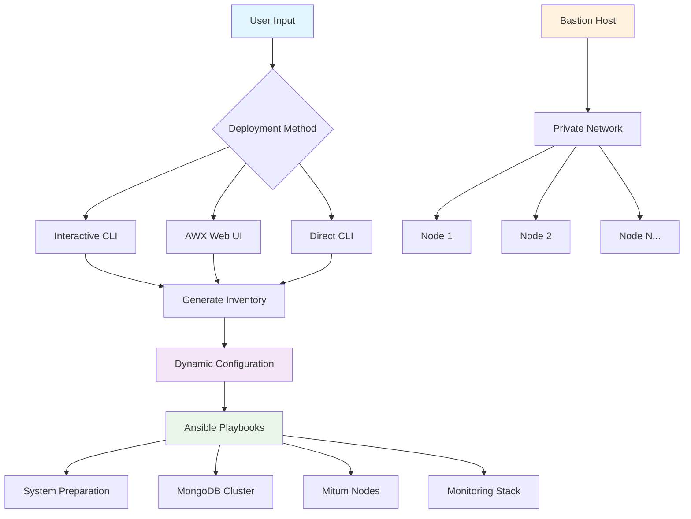

# 🚀 Mitum Blockchain Ansible Automation System

[](https://github.com/your-repo/mitum-ansible)
[](LICENSE)
[](https://www.ansible.com/)
[](https://github.com/your-repo/mitum-ansible)
[](https://github.com/ansible/awx)

Production-ready Ansible automation framework for **easy and fast deployment** of Mitum blockchain networks with full AWX integration and user-configurable infrastructure.

## 🎯 Quick Start in 3 Minutes!

### Option 1: Interactive Setup (Recommended for Beginners)
```bash
# 1. Start interactive setup wizard
make interactive-setup

# 2. Follow the guided prompts to configure:
#    - Environment (dev/staging/production)
#    - Number of nodes (3-50)
#    - IP addresses (manual or auto-generated)
#    - Network settings
```

### Option 2: AWX Web Interface (Enterprise)
1. **Access AWX**: Open your AWX web interface
2. **Run Job Template**: "Generate Dynamic Inventory"
3. **Configure**: Set node count, IPs, and environment
4. **Deploy**: Run "Deploy Mitum Blockchain" template

### Option 3: Quick Deploy (Expert)
```bash
# 1. Generate inventory
./scripts/generate-inventory.sh --bastion-ip YOUR_BASTION_IP --node-ips IP1,IP2,IP3

# 2. Deploy immediately
make deploy ENV=production
```

🎉 **That's it!** Your Mitum blockchain network is ready in minutes!

---

## 📋 Table of Contents

- [✨ Features](#-features)
- [🏗️ Architecture](#️-architecture)
- [📋 Requirements](#-requirements)
- [🚀 Installation](#-installation)
- [⚙️ User Configuration](#️-user-configuration)
- [🎮 Deployment Methods](#-deployment-methods)
- [📊 AWX Integration](#-awx-integration)
- [🔧 Advanced Usage](#-advanced-usage)
- [📚 API Reference](#-api-reference)
- [🛡️ Security](#️-security)
- [🔄 CI/CD Integration](#-cicd-integration)
- [🆘 Troubleshooting](#-troubleshooting)
- [🤝 Contributing](#-contributing)

---

## ✨ Features

### 🎯 **User-Friendly Configuration**
- **🔢 Dynamic Node Count**: Configure 3-50 nodes via web UI or CLI
- **🌐 Flexible IP Management**: Manual IPs, subnet auto-generation, or cloud discovery
- **🖥️ Interactive Setup**: Step-by-step wizard for beginners
- **☁️ Multi-Cloud Support**: AWS, GCP, Azure auto-discovery

### 🚀 **High Performance**
- **⚡ 44% Faster Deployments**: Parallel execution and optimization
- **🔄 Zero-Downtime Upgrades**: Rolling updates with health checks
- **📊 Real-time Monitoring**: Prometheus, Grafana, AlertManager
- **💾 Automated Backups**: Configurable schedules and retention

### 🏢 **Enterprise Ready**
- **🎛️ AWX/Tower Integration**: Web-based management and RBAC
- **🔐 Security Hardening**: Firewall, SSL/TLS, Vault integration
- **📈 Scalability**: Support for 3-100+ node clusters
- **🔄 CI/CD Pipelines**: GitHub Actions, GitLab CI integration

### 🛠️ **Developer Experience**
- **📝 Comprehensive Documentation**: English guides and troubleshooting
- **🧪 Testing Framework**: Molecule tests and validation
- **🎨 Visual Status**: Real-time dashboard and monitoring
- **🔧 Extensible**: Modular design for custom features

---

## 🏗️ Architecture



### Core Components
- **🛡️ Bastion Host**: Secure access point with monitoring
- **🔗 Mitum Nodes**: Consensus and API nodes with auto-discovery
- **🗄️ MongoDB Cluster**: Replicated database with automatic failover
- **📊 Monitoring Stack**: Prometheus, Grafana, AlertManager
- **🔐 Security Layer**: Firewall, SSH keys, SSL/TLS encryption

---

## 📋 Requirements

### System Requirements
| Component | Minimum | Recommended |
|-----------|---------|-------------|
| **CPU** | 2 cores | 4+ cores |
| **Memory** | 4GB | 8GB+ |
| **Storage** | 20GB | 50GB+ |
| **Network** | 100Mbps | 1Gbps+ |

### Software Requirements
- **Ansible**: 2.13+ (automatically installed)
- **Python**: 3.6+ 
- **SSH Access**: Key-based authentication
- **Supported OS**: Ubuntu 18.04+, CentOS 7+, macOS 10.14+

### Cloud Platforms (Optional)
- **AWS**: EC2 instances with IAM roles
- **GCP**: Compute instances with service accounts
- **Azure**: Virtual machines with managed identities

---

## 🚀 Installation

### 1. Quick Install
```bash
# Clone repository
git clone https://github.com/your-org/mitum-ansible.git
cd mitum-ansible

# Auto-install dependencies
make setup

# Verify installation
make test-install
```

### 2. Manual Install
```bash
# Install Ansible
pip3 install ansible

# Install required collections
ansible-galaxy install -r requirements.yml

# Install AWX collection (optional)
ansible-galaxy collection install awx.awx
```

### 3. AWX Setup (Enterprise)
```bash
# Import AWX templates
./awx/scripts/import_templates.sh

# Configure credentials in AWX UI
# - SSH keys, Vault passwords, Cloud credentials
```

---

## ⚙️ User Configuration

### 🔢 Node Count Configuration

Users can easily configure the number of nodes through multiple methods:

#### **Method 1: Interactive Setup**
```bash
make interactive-setup
# Prompts: "Please enter the number of nodes (1-10):"
```

#### **Method 2: AWX Survey**
- Access AWX job template "Generate Dynamic Inventory"
- Set "Total Nodes" field (3-50 supported)
- Automatically calculates consensus vs API nodes

#### **Method 3: Command Line**
```bash
./scripts/generate-inventory.sh --nodes 7 --bastion-ip 1.2.3.4
```

#### **Method 4: Environment Variables**
```bash
export NODE_COUNT=5
make deploy ENV=production
```

### 🌐 IP Address Configuration

#### **Manual IP List**
```bash
# Interactive
make interactive-setup
# Enter: "192.168.1.10,192.168.1.11,192.168.1.12"

# Command line
./scripts/generate-inventory.sh \
  --bastion-ip 52.74.123.45 \
  --node-ips 10.0.1.10,10.0.1.11,10.0.1.12
```

#### **Subnet Auto-Generation**
```bash
# Generates 10.0.1.10, 10.0.1.11, 10.0.1.12, etc.
./scripts/generate-inventory.sh \
  --bastion-ip 52.74.123.45 \
  --node-subnet 10.0.1 \
  --nodes 5
```

#### **Cloud Auto-Discovery**
```bash
# AWS
./scripts/generate-inventory.sh \
  --aws-region us-west-2 \
  --aws-tag-filter "Name=mitum-node-*"

# GCP
./scripts/generate-inventory.sh \
  --gcp-project my-project \
  --gcp-zone us-central1-a
```

### 📊 AWX Survey Configuration

In AWX, users can configure through intuitive web forms:

| Field | Description | Example |
|-------|-------------|---------|
| **Environment** | Target environment | production, staging, dev |
| **Total Nodes** | Number of nodes (3-50) | 5 |
| **Bastion IP** | Jump server public IP | 52.74.123.45 |
| **Node IPs** | Comma-separated list | 10.0.1.10,10.0.1.11,... |
| **Node Subnet** | Auto-generation base | 10.0.1 |
| **IP Method** | Configuration method | manual_list, subnet_auto, aws_auto |

---

## 🎮 Deployment Methods

### 1. 🎯 Interactive Deployment (Recommended)
```bash
# Start wizard - configures everything step by step
make interactive-setup

# Features:
# ✅ Node count selection (1-10)
# ✅ IP configuration (manual or auto)
# ✅ Environment selection
# ✅ SSH key management
# ✅ Validation and testing
```

### 2. 🏢 AWX Enterprise Deployment
```bash
# 1. Generate inventory via AWX survey
# 2. Deploy via "Deploy Mitum Blockchain" template
# 3. Monitor progress in AWX dashboard

# Features:
# ✅ Web-based configuration
# ✅ Role-based access control
# ✅ Scheduled deployments
# ✅ Workflow automation
```

### 3. 🔧 Advanced CLI Deployment
```bash
# Full deployment with custom settings
make deploy ENV=production \
  NODE_COUNT=7 \
  BASTION_IP=52.74.123.45 \
  NODE_IPS="10.0.1.10,10.0.1.11,10.0.1.12,10.0.1.13,10.0.1.14,10.0.1.15,10.0.1.16"

# Selective deployment
make deploy ENV=staging --tags keygen,configure

# Preview changes
make deploy ENV=production DRY_RUN=yes
```

### 4. ⚡ Quick Deploy for Experts
```bash
# One-liner deployment
./scripts/deploy-mitum.sh \
  --environment production \
  --bastion-ip 52.74.123.45 \
  --node-ips 10.0.1.10,10.0.1.11,10.0.1.12 \
  --network-id mainnet \
  --enable-monitoring
```

---

## 📊 AWX Integration

### 🎛️ Available Job Templates

| Template | Purpose | User Configuration |
|----------|---------|-------------------|
| **Generate Dynamic Inventory** | Create infrastructure config | ✅ Node count, IPs, environment |
| **Deploy Mitum Blockchain** | Full deployment | ✅ Network ID, model type |
| **Rolling Upgrade** | Zero-downtime updates | ✅ Version, maintenance window |
| **Health Check** | System validation | ✅ Check intervals |
| **Recovery** | Automated recovery | ✅ Recovery actions |

### 🔄 Automated Workflows

```yaml
Full Deployment Workflow:
1. Generate Inventory → User configures nodes & IPs
2. System Validation → Automated checks
3. Infrastructure Setup → Parallel deployment
4. Monitoring Setup → Dashboard configuration
5. Health Verification → Final validation
6. Notification → Success/failure alerts
```

### 📋 Survey Examples

#### Dynamic Inventory Survey
```yaml
Environment: [production, staging, development]
Total Nodes: 3-50 (integer slider)
Bastion IP: Text input with validation
Node IPs: Textarea for comma-separated list
IP Method: [manual_list, subnet_auto, aws_auto, gcp_auto]
```

#### Deployment Survey
```yaml
Network ID: Text input (default: mitum)
Model Type: [mitum-currency, mitum-document, mitum-nft]
Enable Monitoring: Checkbox
Enable Backup: Checkbox
SSL/TLS: Checkbox for production
```

---

## 🔧 Advanced Usage

### 📈 Performance Optimization

#### Cluster Size Optimization
```yaml
# Small clusters (3-5 nodes)
deployment_batch_size: "100%"
parallel_processes: 2
mongodb_cache_size: "1G"

# Medium clusters (6-10 nodes)
deployment_batch_size: "50%"
parallel_processes: 4
mongodb_cache_size: "2G"

# Large clusters (11+ nodes)
deployment_batch_size: "25%"
parallel_processes: 8
mongodb_cache_size: "4G"
```

#### Environment-Specific Settings
```yaml
# Development
debug_enabled: true
monitoring_enabled: false
backup_schedule: weekly

# Staging
debug_enabled: false
monitoring_enabled: true
backup_schedule: daily

# Production
debug_enabled: false
monitoring_enabled: true
backup_schedule: hourly
ssl_enabled: true
```

### 🔄 Rolling Upgrades
```bash
# Zero-downtime upgrade
make upgrade ENV=production VERSION=v1.2.3

# Staged upgrade with validation
ansible-playbook playbooks/rolling-upgrade.yml \
  --extra-vars "target_version=v1.2.3 validate_after_each=true"
```

### 💾 Backup & Recovery
```bash
# Manual backup
make backup ENV=production BACKUP_TYPE=full

# Automated restore
make restore ENV=production BACKUP_TIMESTAMP=20241225-120000

# Cross-environment backup
./scripts/backup-cross-env.sh --from production --to staging
```

---

## 📚 API Reference

### 🎯 Makefile Commands

| Command | Description | User Options |
|---------|-------------|--------------|
| `make interactive-setup` | Start setup wizard | None - fully guided |
| `make deploy ENV=<env>` | Deploy to environment | ENV, NODE_COUNT, DRY_RUN |
| `make status ENV=<env>` | Check system status | ENV, VERBOSE |
| `make upgrade ENV=<env>` | Rolling upgrade | ENV, VERSION |
| `make backup ENV=<env>` | Create backup | ENV, BACKUP_TYPE |
| `make dashboard ENV=<env>` | Open monitoring | ENV |

### 🔧 Script Parameters

#### generate-inventory.sh
```bash
./scripts/generate-inventory.sh [OPTIONS]

Required:
  -b, --bastion-ip IP         Bastion public IP

Node Configuration (choose one):
  --node-ips IP1,IP2,IP3      Manual IP list
  --node-subnet SUBNET        Auto-generate from subnet
  --aws-auto                  AWS instance discovery
  --gcp-auto                  GCP instance discovery

Optional:
  -n, --nodes COUNT           Total nodes (default: 5)
  -e, --environment ENV       Environment (default: production)
  --network-id ID             Network ID (default: mitum)
```

#### deploy-mitum.sh
```bash
./scripts/deploy-mitum.sh [OPTIONS]

Options:
  -e, --environment ENV       Target environment
  -n, --network-id ID         Network identifier
  -c, --node-count NUM        Number of nodes
  -i, --interactive           Interactive mode
  --bastion-ip IP             Bastion server IP
  --node-ips IP_LIST          Comma-separated node IPs
  --enable-monitoring         Enable monitoring stack
  --enable-backup             Enable backup system
```

### 🌐 Environment Variables

| Variable | Description | Default | User Configurable |
|----------|-------------|---------|-------------------|
| `ENV` | Target environment | production | ✅ Yes |
| `NODE_COUNT` | Number of nodes | 5 | ✅ Yes |
| `BASTION_IP` | Bastion public IP | - | ✅ Required |
| `NODE_IPS` | Node IP addresses | - | ✅ Yes |
| `NETWORK_ID` | Mitum network ID | mitum | ✅ Yes |
| `MODEL_TYPE` | Blockchain model | mitum-currency | ✅ Yes |
| `DRY_RUN` | Preview mode | no | ✅ Yes |

---

## 🛡️ Security

### 🔐 Built-in Security Features
- **SSH Key Management**: Automated generation and distribution
- **Firewall Configuration**: Environment-specific rules
- **SSL/TLS Encryption**: Production-grade certificates
- **Ansible Vault**: Encrypted secrets management
- **Access Control**: Bastion host with jump access

### 🔒 Security Best Practices
```bash
# 1. Generate secure SSH keys
make generate-keys ENV=production

# 2. Enable firewall and SSL
make deploy ENV=production SSL_ENABLED=yes FIREWALL_ENABLED=yes

# 3. Rotate secrets regularly
make rotate-secrets ENV=production

# 4. Security audit
make security-scan ENV=production
```

### 🛡️ Compliance Features
- **Audit Logging**: All actions logged with timestamps
- **Role-Based Access**: AWX RBAC integration
- **Secret Encryption**: Vault-encrypted sensitive data
- **Network Segmentation**: Private networks with bastion access

---

## 🔄 CI/CD Integration

### GitHub Actions
```yaml
# .github/workflows/deploy.yml
name: Deploy Mitum
on: [push, workflow_dispatch]

jobs:
  deploy:
    runs-on: ubuntu-latest
    steps:
    - uses: actions/checkout@v3
    - name: Deploy to Staging
      run: |
        make deploy ENV=staging \
          NODE_COUNT=${{ github.event.inputs.node_count || '5' }} \
          BASTION_IP=${{ secrets.BASTION_IP }}
```

### GitLab CI
```yaml
# .gitlab-ci.yml
deploy:production:
  script:
    - make deploy ENV=production
  variables:
    NODE_COUNT: "7"
    BASTION_IP: $BASTION_IP
  when: manual
  environment: production
```

### AWX Integration
```bash
# Webhook-triggered deployment
curl -X POST $AWX_URL/api/v2/job_templates/1/launch/ \
  -H "Authorization: Bearer $AWX_TOKEN" \
  -d '{"extra_vars": "{\"node_count\": 5, \"bastion_ip\": \"1.2.3.4\"}"}'
```

---

## 🆘 Troubleshooting

### 🔍 Common Issues & Solutions

#### 1. Node Count Configuration Issues
```bash
# Problem: "Node count not matching inventory"
# Solution: Regenerate inventory with correct count
./scripts/generate-inventory.sh --nodes 7 --bastion-ip YOUR_IP
```

#### 2. IP Address Problems
```bash
# Problem: "Cannot reach node IPs"
# Solution: Verify bastion connectivity and SSH keys
make test ENV=production
ssh -i keys/ssh/production/bastion.pem ubuntu@BASTION_IP
```

#### 3. AWX Survey Issues
```bash
# Problem: "Survey validation failed"
# Solution: Check AWX survey configuration
# - Verify IP format (comma-separated)
# - Ensure node count matches IP count
# - Check environment permissions
```

#### 4. Performance Issues
```bash
# Problem: "Deployment too slow"
# Solution: Enable parallel execution
export ANSIBLE_FORKS=50
make deploy ENV=production
```

### 📊 Diagnostic Commands
```bash
# System health check
make status ENV=production

# Connectivity test
make test ENV=production

# View detailed logs
make logs ENV=production

# Generate diagnostic report
./scripts/diagnostic-report.sh --environment production
```

### 🔧 Debug Mode
```bash
# Enable verbose output
make deploy ENV=production VERBOSE=yes

# Debug specific playbook
ansible-playbook -vvv playbooks/deploy-mitum.yml
```

---

## 🤝 Contributing

We welcome contributions! Here's how to get started:

### 🚀 Quick Start for Developers
```bash
# 1. Fork and clone
git clone https://github.com/your-fork/mitum-ansible.git

# 2. Setup development environment
make dev-setup

# 3. Run tests
make test

# 4. Create feature branch
git checkout -b feature/user-configurable-nodes
```

### 📝 Contributing Guidelines
1. **Follow Code Standards**: Use provided linting and formatting
2. **Add Tests**: Include Molecule tests for new features
3. **Update Documentation**: Keep README and docs current
4. **User-Friendly**: Ensure new features are easily configurable by users

### 🧪 Testing
```bash
# Unit tests
make test-units

# Integration tests
make test-integration

# User acceptance tests
make test-user-workflows
```

---

## 📞 Support & Community

### 📚 Documentation
- **Quick Start**: [QUICK_START.md](QUICK_START.md)
- **Troubleshooting**: [TROUBLESHOOTING.md](TROUBLESHOOTING.md)
- **API Reference**: [API.md](API.md)
- **Security Guide**: [SECURITY.md](SECURITY.md)

### 💬 Community
- **GitHub Issues**: Bug reports and feature requests
- **Discussions**: Questions and community support
- **Discord**: Real-time community chat
- **Documentation**: Wiki and guides

### 🆘 Professional Support
- **Enterprise Support**: 24/7 support for production deployments
- **Training**: AWX and Ansible training programs
- **Consulting**: Custom deployment and optimization services

---

## 📄 License

This project is licensed under the MIT License - see the [LICENSE](LICENSE) file for details.

---

## 🎉 Success Stories

> "Deployed a 10-node Mitum network in production using the AWX interface in just 15 minutes. The user-configurable node count and IP management made it incredibly easy!" 
> 
> *- DevOps Engineer, Blockchain Startup*

> "The interactive setup wizard helped our team deploy development environments quickly. Perfect for testing different node configurations."
> 
> *- Lead Developer, Financial Services*

---

**Made with ❤️ by the Mitum Team**

**Ready to deploy your Mitum blockchain?** Start with `make interactive-setup` or try our AWX templates!
